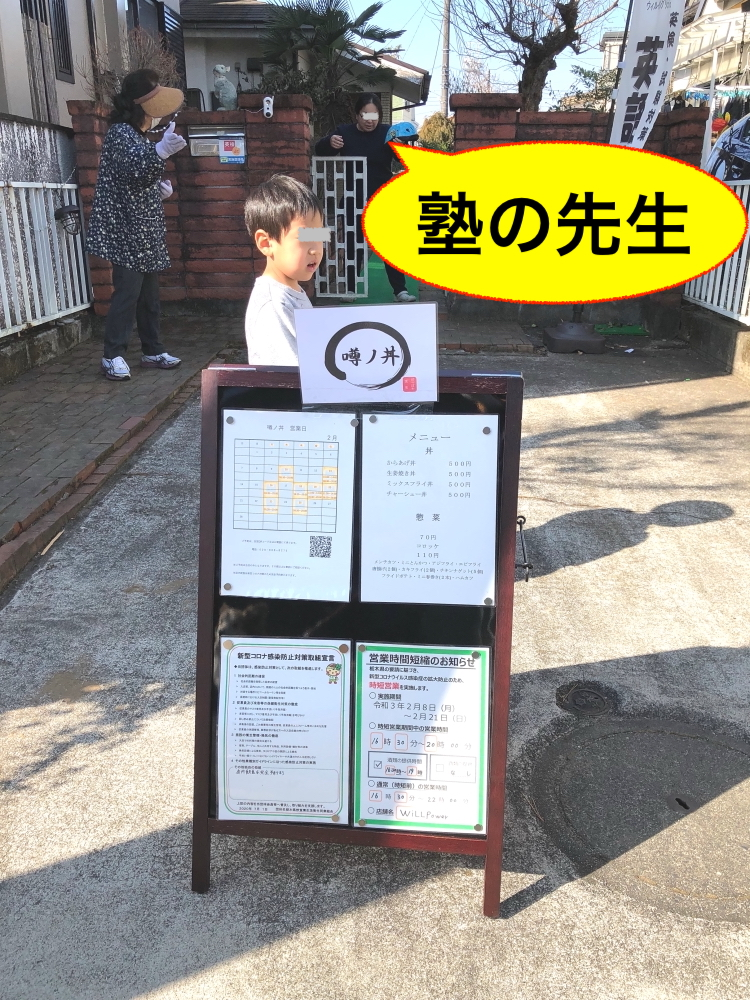
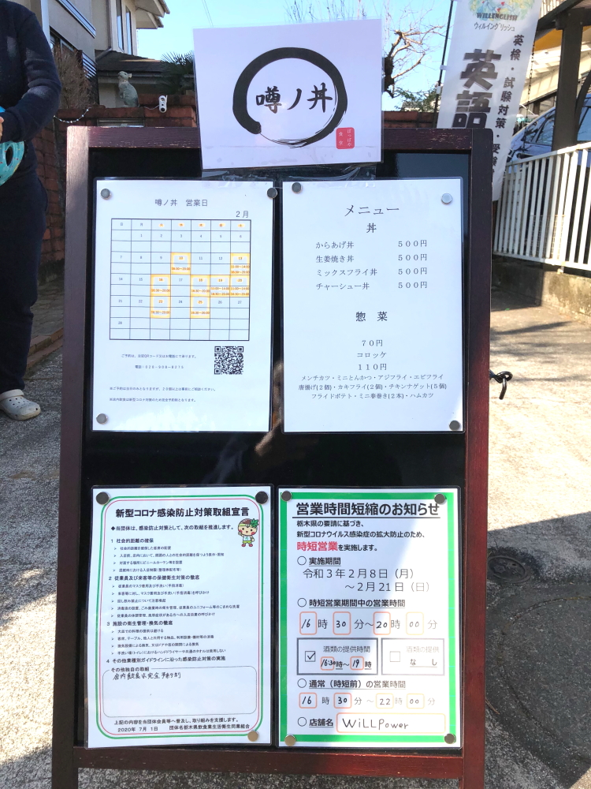
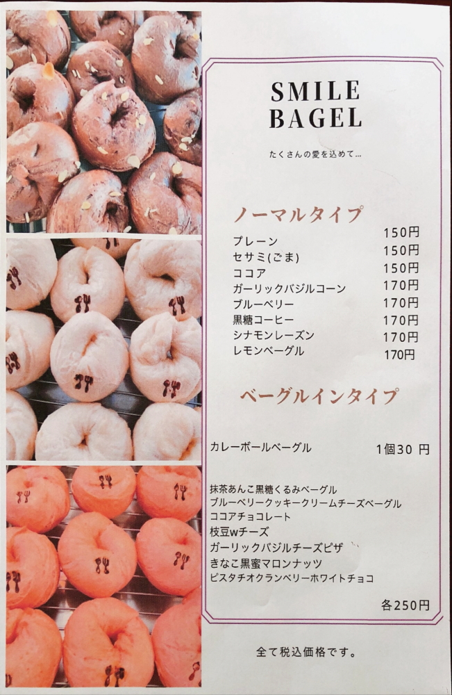
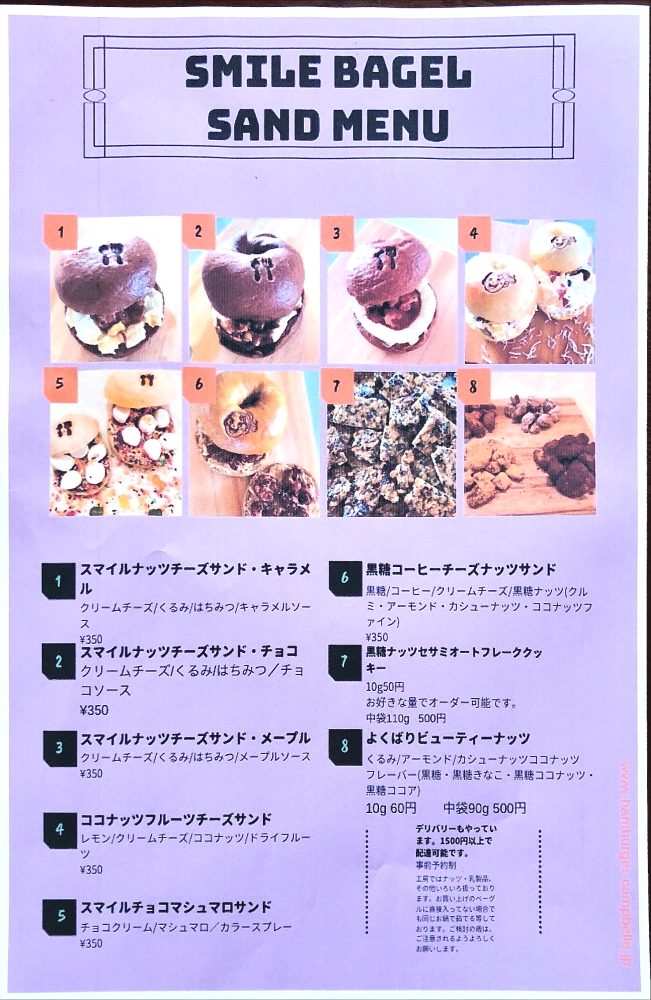
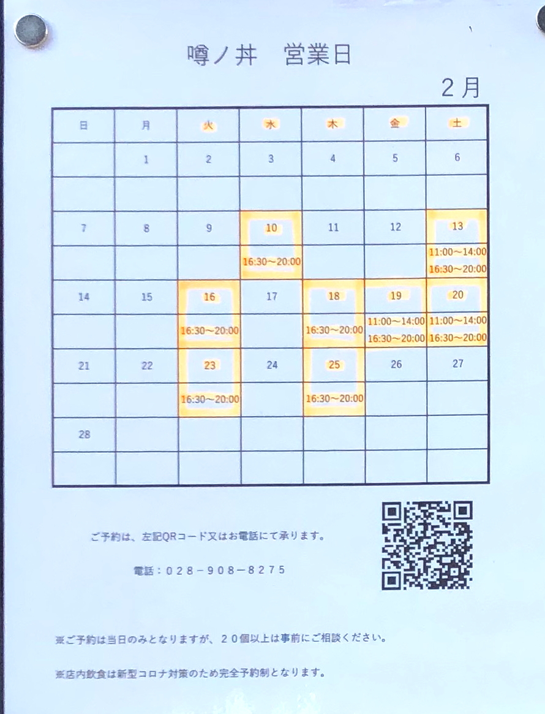

# uwasanodon

<html>
<head>

<meta charset="UTF-8">
<meta http-equiv="Content-Type" content="text/html; charset=UTF-8">
<meta http-equiv="X-UA-Compatible" content="IE=EmulateIE10" />
<meta http-equiv="X-UA-Compatible" content="IE=edge">

<!--ここから上はお決まりの定型文です-->

<!--ここからが表現の書式などを決めるcssという部分-->

<link href="https://cdnjs.cloudflare.com/ajax/libs/lightbox2/2.7.1/css/lightbox.css" rel="stylesheet">

</head>

<body>

  モバイル端末をお使いの場合は、画面を横向きにすると
  より見やすくご覧頂けます。

    
<!--ここまでは定型文としてそのままコピペして再利用します-->

 アクセス用QRコード

<h1><marquee behavior="alternate">!!! 久々にご近所で犬の散歩していてら、住宅街の中にお持ち帰りの丼屋さんができてました !!!</marquee></h1>

<h3>メニューを見ていたら、一家総出でお出迎え</h3>

 
<h3>同じ場所に英語の塾も併設されていて、奥様が英語の先生です 英語塾のHPリンク↓</h3>
	
<a href="https://www.willenglish.jp/" target="_blank" rel="noopener noreferrer">https://www.willenglish.jp/</a>

	
<h3>しばらくするとBAGELの販売も始めるそうです</h3>

<h3>2月の営業カレンダー</h3>

<h3>最後になりましたが、噂の丼、HPリンク↓</h3>
<a href="https://omochikaeri.com/r/ZARRaHwXOdswhGm3EMCK" target="_blank" rel="noopener noreferrer">https://omochikaeri.com/r/ZARRaHwXOdswhGm3EMCK</a>

<h3>BAGEL用のHPもありました。HPリンク↓</h3>
<a href="https://omochikaeri.com/r/HwC5a9XcY3zgIES41tBT" target="_blank" rel="noopener noreferrer">https://omochikaeri.com/r/HwC5a9XcY3zgIES41tBT</a>
 
<h3>このお店のシステムは全国展開されている様ですね↓</h3>
<a href="https://omochikaeri.com/" target="_blank" rel="noopener noreferrer">https://omochikaeri.com/</a>

                                                            

<!-- フッタ -->
 <footer>
 Copyright 2021/02/21 S.Hada
 </footer>
 
 <!--HPにさまざまなJavaScriptを呼び込むための書式-->

 
 

</body>

</html>
